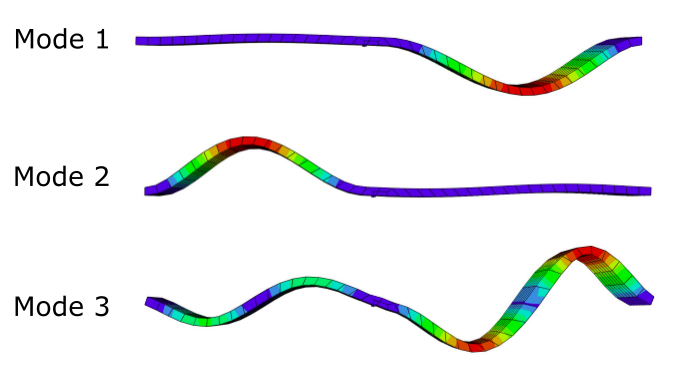

# UofSC Walking Bridge A
Walking Bridge A behind 300 Main St. at the UofSC.

   
Walking Bridge A behind the UofSC engineering building.

   
Frequency response of the bridge averaged across multiple accelerometers

   
First three modes shapes of Bridge A.

