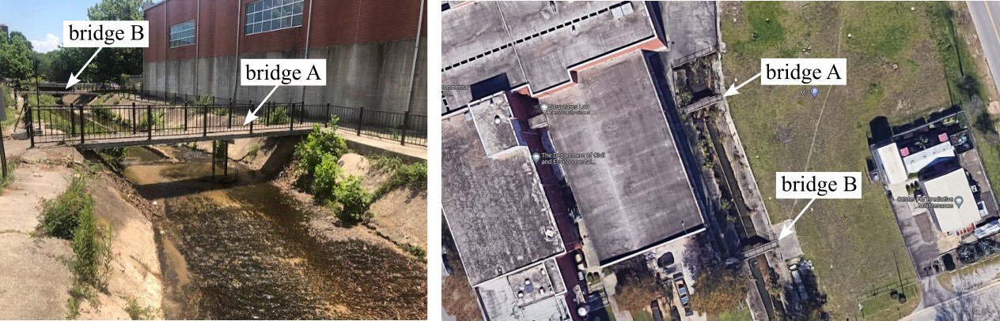

# UofSC-Walking-Bridges
Two walking bridges behind 300 Main St. at the UofSC used for testing and validating structural health monitoring solutions. The Northern bridge (A) and southern bridge (B) span Rocky Branch Creek and constructed of recycled railroad tracks and reinforced concrete cast in place. 

   
Walking Bridge A and B behind 300 Main Street in Columbia SC which houses UofSC Mechanical and Civil Engineering facilities. 

## [Bridge A](Bridge_A)

Pedestrian bridge A with sensor network deployment.

Frequency domain analysis of the pedestrian bridge response averaged across multiple accelerometers.

## [Bridge B](Bridge_B)

Pedestrian bridge B experimental setup with a sensor network deployment along with a structural mass shaker.

Contineous excitation test data of the three sensing nodes on a pedestrian bridge with time and frequency domain measurements.

## Licensing and Citation

This work is licensed under a Creative Commons Attribution-ShareAlike 4.0 International License [cc-by-sa 4.0].

