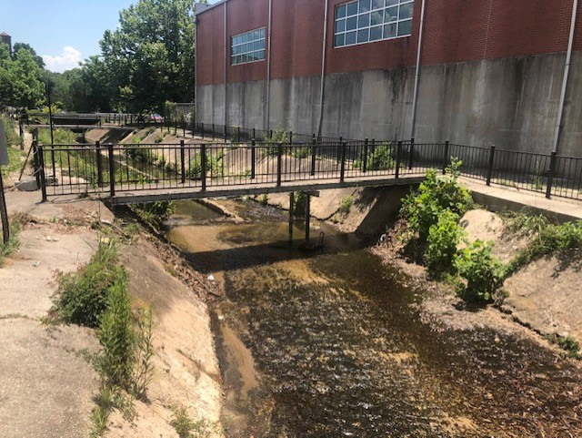

# UofSC-Walking-Bridge
A walking bridge behind 300 Main at the UofSC used for testing and validating structural health monitoring solutions 

   
Walking bridge behind the UofSC Engineering Building

## [FEA Models](FEA_model)
1. FEA models of the bridge

## [CAD Models](CAD_model)
1. CAD models of the bridge

## [Modal Analysis](modal_analysis)
1. Experimental modal analysis of the bridge

